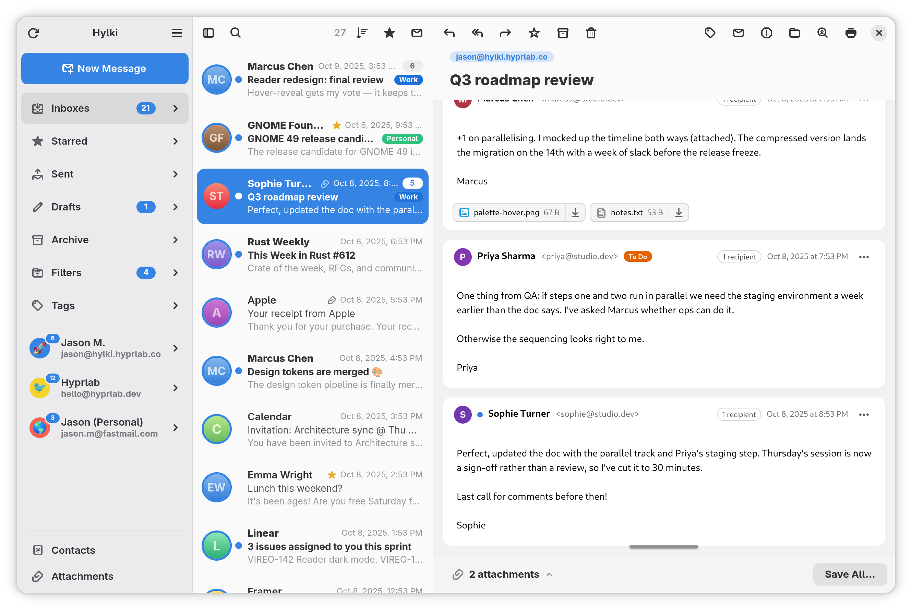

<p align="center">
  
</p>

<h1 align="center">Hylki</h1>

<p align="center">
  A fast, <strong>GNOME-native</strong> email client, built with Rust and libadwaita. Open source and private by default. 
</p>

<p align="center">
  <a href="https://hylki.hyprlab.co">Website</a> ·
  <a href="docs/FEATURES.md">Features</a> ·
  <a href="docs/DOCUMENTATION.md">Documentation</a> ·
  <a href="https://github.com/hyprlab/hylki/releases">Releases</a> ·
  <a href="https://discord.gg/YfEJ4b6PFW">Discord</a>
  <br>
  
</p>

<p align="center">
  <picture>
    <source media="(prefers-color-scheme: dark)" srcset="data/repo/screenshot-dark.png">
    
  </picture>
</p>

---

Hylki is a GNOME-native desktop email client for the Linux desktop. It talks
IMAP/SMTP directly, keeps your mail and credentials on your machine, and blocks
trackers by default: no telemetry, no analytics. It is free software, built
for GNOME first, and it would rather be beautiful *and* complete than pick one
([the manifesto](docs/MANIFESTO.md)).

> [!NOTE]
> **Vireo is now Hylki.** As of v1.35.0 the app formerly known as Vireo (and,
> before v1.6.0, Veem) has a new name and icon. Same app, same code. Hylki's
> first start carries your accounts, settings and cached mail across from
> Vireo, which is left untouched until you remove it.

## Features

- **Multiple accounts:** IMAP and POP3, each on its own background worker,
  with a unified *Inboxes* view. OAuth for Google and Microsoft.
- **Whole-mailbox sync and search:** no message-count cap. The first page is
  instant; the rest indexes in the background.
- **Two-way sync:** deletions, moves and flags from your phone or another
  client land here automatically.
- **Four ways to write:** rich text, Markdown, hand-written HTML or plain
  text, switched per message.
- **Outbox and Send Later:** a failed send waits for the connection instead of
  being lost, and a message can be scheduled for any time.
- **Cloud attachments:** put a big file on your own Nextcloud, ownCloud,
  OpenCloud or Seafile, or on OneDrive or Dropbox, and send the link.
- **Privacy-first reading:** remote content blocked by default, per-sender
  allow lists, and Reader View to strip a message down to what it says.
- **OpenPGP:** read, sign and encrypt mail, and manage keys, through the
  GnuPG already on your computer.
- **Filters and tags:** multi-condition rules that tag mail and file it away,
  as server keywords where the server has them.
- **Keyboard-driven:** Gmail-style single-key shortcuts, off until you want
  them ([the list](docs/KEYBOARD_SHORTCUTS.md)).
- **GNOME-native:** adaptive three-pane layout, five appearance themes, Focus
  Mode, light and dark following the system, optional background running.

**[All of it, in detail →](docs/FEATURES.md)**

## Installing

**Flatpak (recommended):** any distribution, x86_64 and aarch64, updated from
the signed repo:

```sh
flatpak install --user --from https://hylki.hyprlab.co/flatpak/co.hyprlab.Hylki.flatpakref
```

**Fedora:** the `.rpm` from the
[latest release](https://github.com/hyprlab/hylki/releases/latest):

```sh
sudo dnf install ./hylki-*.x86_64.rpm
```

Community-maintained **Gentoo** and **Nix** packages, direct `.flatpak`
downloads and the beta channel are in
**[docs/INSTALLING.md](docs/INSTALLING.md)**. Building it yourself is
**[docs/BUILDING.md](docs/BUILDING.md)**.

## Documentation

| | |
| --- | --- |
| [Features](docs/FEATURES.md) | Everything the app does |
| [Documentation](docs/DOCUMENTATION.md) | Accounts, OAuth, cloud attachments, Markdown, OpenPGP, GNOME Files, privacy |
| [Keyboard shortcuts](docs/KEYBOARD_SHORTCUTS.md) | The single-key scheme |
| [Installing](docs/INSTALLING.md) · [Building](docs/BUILDING.md) | Every way to get it |
| [Contributing](docs/CONTRIBUTING.md) · [Credits](docs/CREDITS.md) | How to help, and who has |
| [Release notes](docs/RELEASE_NOTES.md) · [Changelog](CHANGELOG.md) | What changed, and when |

## Privacy

No telemetry, no analytics. Remote content in messages is blocked by default to
defeat tracking pixels. Passwords and OAuth tokens live in the system keyring,
never in plain files, and decrypted mail is never cached. Details in
[Documentation](docs/DOCUMENTATION.md#privacy).

## AI notice

Hylki is built by a human maintainer working with generative AI as a
development tool:

- **Code:** the large majority of the Rust code in this repository was written
  with Anthropic's Claude (via Claude Code), working from the maintainer's
  direction. The maintainer decides what gets built, reviews the results, tests
  every release, and signs off on everything that ships. Commits are the
  maintainer's own: this notice is where the tool is declared, rather than a
  trailer on every commit.
- **Text:** documentation, release notes, and website copy are largely
  AI-drafted and human-edited.
- **Artwork:** the app icon and other visual assets are human-made, without
  generative AI.
- **The app itself contains no AI.** Hylki has no AI features, makes no
  requests to AI services, and never sends your mail or any other data to one:
  AI was used to *build* the app, not to run it.

Bug reports and pull requests are welcome from humans and their AI tools alike;
everything merged gets the same human review.

## Contributing

Hylki is maintained by Hyprlab and shaped by the people who use it. Bug
reports, feature requests, design and HIG feedback, translations, packaging and
code are all welcome, and everyone whose work is in the app is named in the
About window and in [CREDITS.md](docs/CREDITS.md).

Translating takes no Rust at all ([po/README.md](po/README.md)), and a good bug
report is worth as much as a patch. **[How to help →](docs/CONTRIBUTING.md)**

## Contact & support

- Website: [hylki.hyprlab.co](https://hylki.hyprlab.co)
- Discord: [discord.gg/YfEJ4b6PFW](https://discord.gg/YfEJ4b6PFW)
- Email: [hyprlab@proton.me](mailto:hyprlab@proton.me)
- Security: [SECURITY.md](docs/SECURITY.md)
- [Buy me a coffee](https://buymeacoffee.com/hyprlab) ☕

## License

Hylki is free software licensed under the **GNU Affero General Public License
v3.0 or later** ([AGPL-3.0-or-later](LICENSE)). Third-party marks, logos and
themes it bundles are listed in [docs/LICENSE.md](docs/LICENSE.md).

© 2026 Hyprlab
